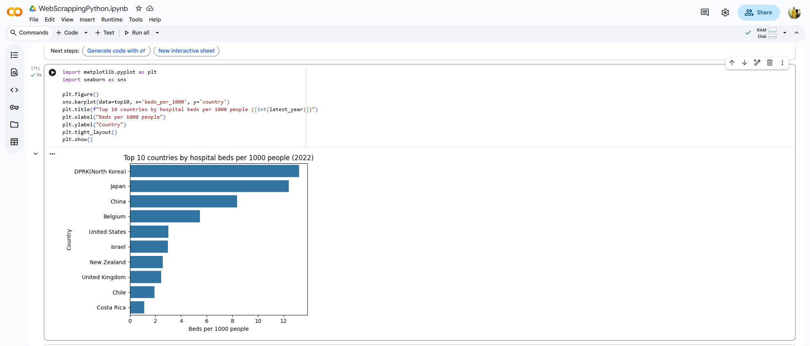
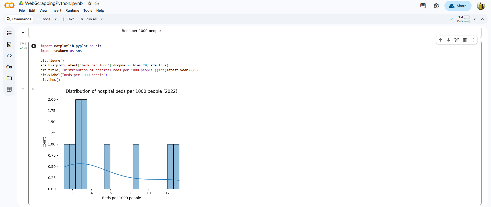
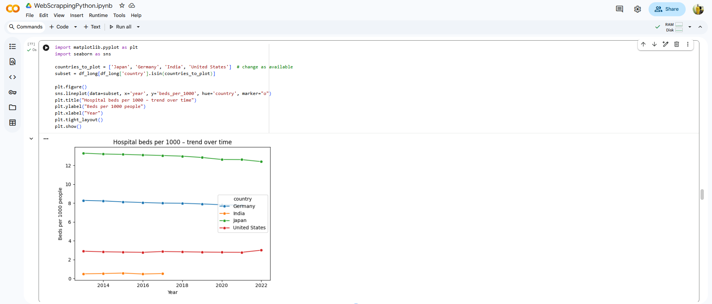
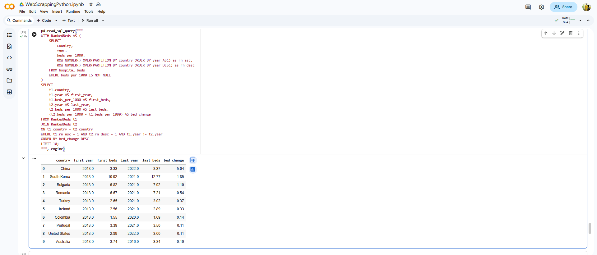

# Global Hospital Beds Web Scraping & SQL Analysis 🐍📊

## 1. Overview
Built a fully automated Python-based ETL pipeline to extract, clean, and normalize global hospital bed statistics from a complex Wikipedia table. The cleaned dataset was then loaded into a relational database for advanced exploratory analysis using SQL.

### 🎯 Goal
To create a robust, consistent, and up-to-date dataset for comparative analysis of healthcare infrastructure across various countries, specifically focusing on beds per 1000 population over time.

## 2. Tools & Technologies (The Python/SQL Stack)
- **Python Libraries:** `Requests`, **`BeautifulSoup`** (Web Scraping), **`Pandas`** (Data Cleaning/Normalization), **`re`** (Regular Expressions)
- **Data Storage:** **SQLite** (managed using `SQLAlchemy`)
- **SQL Analysis:** **Window Functions** (ROW_NUMBER()), Aggregate Functions, CTEs

## 3. Key Actions / Process (The Automated ETL Pipeline)
- **Web Scraping:** Developed Python scripts to identify the correct complex HTML table on the Wikipedia source and parsed the raw data using **`BeautifulSoup`**.
- **Data Cleaning & Normalization:** Used Pandas to handle missing data and apply **regular expressions** (`re`) to identify and extract year columns from inconsistent headers. Cleaned and normalized data with a **99% data normalization rate.**
- **Data Loading (ELT):** Transformed the cleaned data into an analytical long format and loaded it into an **SQLite** database using the `SQLAlchemy` library.
- **Advanced SQL Analysis:** Executed complex queries, utilizing **ROW_NUMBER()** window functions, to compare 'first-year' vs. 'last-year' beds and analyze longitudinal volatility trends.

## 4. Key Achievements & Results
- **Automation & Robustness:** Successfully built a robust automated pipeline that handles inconsistent column formats and cleans irregular multi-level headers with minimal manual intervention.
- **Technical Depth:** Demonstrated proficiency in the end-to-end ETL process, from scraping the web to loading into a database, a full-stack data analyst skill.
- **Statistical Insight:** Used **SQL Window Functions** to analyze longitudinal trends, revealing countries with the fastest growth in hospital bed capacity and the most consistent healthcare systems.

## 5. View Project
- **Source Code (Web Scraping & SQL Logic):** `WebScrappingPython.ipynb` (Available in this repository)
- **Key SQL Queries:** `analysis_queries.sql` (Complex SQL queries are separated here for reviewer convenience)
